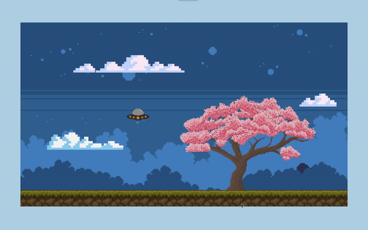

# GameScene Assets and Properties Guide

## Introduction
This guide provides detailed information about the assets and properties used in the `GameScene` class for a Phaser game project. Each asset's name, file path, origin, scale, position, and specific animations or functions are explained.
> to init project: [project init.md](/project%20init.md)

## Background Elements
1. **Background (bg)**
   - **Path:** `assets/image/game-scene/background/background-dark.png`
   - **Origin:** (0, 0)
   - **Scale:** Default
   - **Position:** (0, 0)

2. **Background Layer 1 (bgLayer1)**
   - **Path:** `assets/image/game-scene/background/bg-dark-layer1.png`
   - **Origin:** (0, 0)
   - **Scale:** Default
   - **Position:** (0, 0)

3. **Background Layer 2 (bgLayer2)**
   - **Path:** `assets/image/game-scene/background/bg-dark-layer2.png`
   - **Origin:** (0, 0)
   - **Scale:** Default
   - **Position:** (0, 0)

## Cloud Platforms
### all cloud stay in `staticGroup` calls `cloudGroup`
1. **Cloud 1 (cloud1)**
   - **Path:** `assets/image/game-scene/platforms/cl-long.png`
   - **Origin:** (0, 1)
   - **Scale:** 0.6
   - **Position:** (100, 500)

2. **Cloud 2 (cloud2)**
   - **Path:** `assets/image/game-scene/platforms/cl.png`
   - **Origin:** (1, 1)
   - **Scale:** 0.6
   - **Position:** (1240, 330)

3. **Cloud 3 (cloud3)**
   - **Path:** `assets/image/game-scene/platforms/cl-long2.png`
   - **Origin:** (0, 1)
   - **Scale:** 0.6
   - **Position:** (200, 200)

## Animated Sakura
- **Sakura (sakura)**
  - **Path:** `assets/image/game-scene/spritesheets/sakuraAnim.png`
  - **Origin:** (0.5, 1)
  - **Scale:** 0.6
  - **Position:** (890, 660)
  - **Animation Key:** `sakuraAnim`
  - **Frames:** From 0 to 5
  - **Frame Rate:** 5
  - **Repeat:** Infinite Loop

## Platform Base
- **Platform Base (platformBase)**
  - **Path:** `assets/image/game-scene/platforms/platform-long4.png`
  - **Origin:** (0.5, 1)
  - **Position:** (640, 730)

## Player
- **Player (player)**
  - **Path:** `assets/image/_dev/ufo.png`
  - **Origin:** (0.5, 0.5)
  - **Scale:** 0.05
  - **Position:** (460, 360)
  - **Size:** (2000, 1000)

## Update Function
- The `update()` function in `GameScene` continuously moves the background layers horizontally to create a parallax effect.
  - **Background:** Moves at a speed of `0.03`
  - **Background Layer 1:** Moves at a speed of `0.07`
  - **Background Layer 2:** Moves at a speed of `0.1`

---

# Result preview

